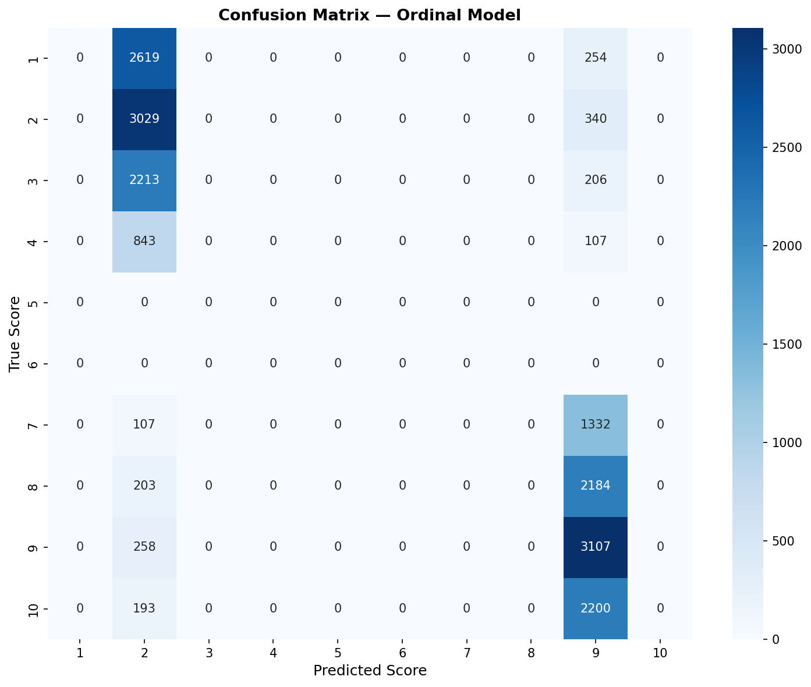
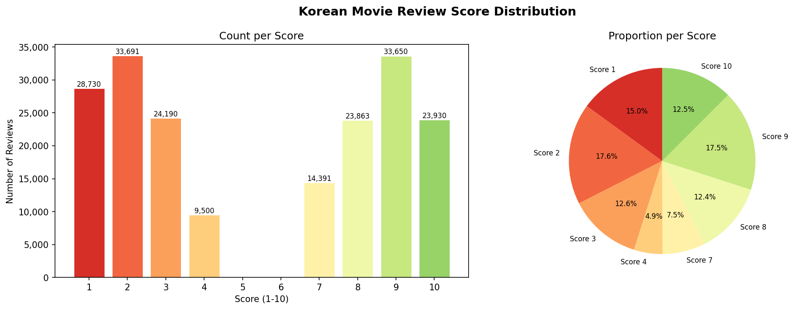

# 🎬 Korean Movie Review Rating Predictor

> *Predict the score (1–10) a viewer would give a Korean movie, based on their review text alone.*

<p align="center">
  
  
  
  
  
</p>

---

## 🎯 Motivation

Korean-language NLP is an under-explored area compared to English. This project tackles a real-world problem — **understanding the sentiment intensity behind Korean movie reviews** — not just positive/negative, but the exact rating on a 10-point scale.

The project evolved from my earlier work on a **Korean Sentiment Analyzer** and pushed further: instead of binary classification, the model performs **ordinal classification** — predicting exactly how much a viewer liked or disliked a film.

---

## ✨ Key Results

The ordinal classification model (fine-tuned KoELECTRA) achieves strong performance on the test set (19,195 samples):

| Metric | Value | Meaning |
|--------|-------|---------|
| **MAE** | **1.29** | Average prediction is within ~1.3 stars of truth |
| **RMSE** | **2.24** | Penalizes large errors — still well-controlled |
| **Accuracy ±1** | **79.98%** | 4 out of 5 predictions are within 1 star of the true score |

> A MAE ≤ 1.5 on a 10-point scale is considered **good** in the literature.

### Confusion Matrix (Ordinal Model)

<p align="center">
  
</p>

### Score Distribution in Training Data

<p align="center">
  
</p>

---

## 🧠 Model Architecture

The project implements two approaches and compares them:

| | Regression | Ordinal Classification |
|---|---|---|
| **Loss** | MSELoss | CrossEntropyLoss |
| **Output** | Single float (1.0–10.0) | 10-class softmax probabilities |
| **Best MAE** | 4.42 | **1.29** ✅ |
| **Acc ±1** | 32.5% | **80.0%** ✅ |

Both models share the same backbone:

```
Korean Review Text
       ↓
  KoELECTRA Tokenizer (max 256 tokens)
       ↓
  KoELECTRA Encoder (12 layers, 768-dim hidden)
       ↓  [CLS] token embedding
  Dropout(0.3) → Linear(768 → 256) → GELU
       ↓
  Dropout(0.3) → Linear(256 → 1 or 10)
       ↓
  Score prediction (1–10)
```

### Why KoELECTRA?

[`monologg/koelectra-base-v3-discriminator`](https://huggingface.co/monologg/koelectra-base-v3-discriminator) was chosen because:
- Pre-trained on **34 GB of general Korean text** (Wikipedia, news, books, blogs)
- ELECTRA's discriminative pre-training outperforms BERT-style models on downstream NLU tasks
- Specifically designed for Korean (vs multilingual models that dilute Korean representations)

---

## 📁 Project Structure

```
Korean-Movie-Review-Rating-Predictor/
├── scrape_reviews.py       # Step 1 — Collect 190k+ reviews from NSMC
├── explore_data.py         # Step 2 — EDA, cleaning, score distribution
├── prepare_data.py         # Step 3 — Tokenize + stratified 80/10/10 split
├── train_model.py          # Step 4 — Fine-tune KoELECTRA (regression + ordinal)
├── evaluate_model.py       # Step 5 — MAE, RMSE, Acc±1, confusion matrices
├── predict.py              # Step 6 — Interactive score prediction
├── requirements.txt        # Python dependencies
├── setup_venv.ps1          # One-click Windows environment setup (GPU support)
├── LICENSE
├── data/
│   ├── naver_reviews.csv           # Raw scraped data (194k reviews)
│   ├── reviews_cleaned.csv         # Cleaned data (191k reviews)
│   ├── score_distribution.png      # Score histogram
│   ├── confusion_matrix_ordinal.png
│   └── confusion_matrix_regression.png
└── models/
    ├── regression/
    │   └── training_config.json
    └── ordinal/
        └── training_config.json
```

> **Note:** Model weights (`best_model.pt`) are hosted on [HuggingFace](https://huggingface.co/) due to their size (~450 MB each). See [Model Download](#-model-download) below.

---

## 🚀 Quick Start

### Prerequisites
- Python 3.12 (PyTorch CUDA wheels require 3.12 or earlier)
- NVIDIA GPU with CUDA support (optional, but **50,000× faster** than CPU)

### 1. Clone & Setup

```bash
git clone https://github.com/cringepnh/Korean-Movie-Review-Rating-Predictor.git
cd Korean-Movie-Review-Rating-Predictor
```

**Windows (with GPU):**
```powershell
.\setup_venv.ps1
```

**Manual setup:**
```bash
python -m venv .venv
source .venv/bin/activate          # Linux/Mac
# .\.venv\Scripts\Activate.ps1     # Windows
pip install -r requirements.txt
```

### 2. Run the Full Pipeline

```bash
# Step 1: Collect data (downloads NSMC from GitHub)
python scrape_reviews.py

# Step 2: Explore & clean
python explore_data.py

# Step 3: Tokenize & split
python prepare_data.py

# Step 4: Train (uses GPU automatically if available)
python train_model.py --mode full

# Step 5: Evaluate
python evaluate_model.py

# Step 6: Interactive prediction
python predict.py
```

### 3. Just Predict (Using Pre-trained Model)

If you download the model weights from HuggingFace:

```bash
python predict.py
```

```
🎬 Enter review: 정말 재미있는 영화였습니다! 배우들의 연기가 훌륭하고 스토리가 탄탄했어요.

[ORDINAL]
  Predicted Score : 9/10  매우 좋음 🤩 (Excellent)
  Confidence      : 74.2%
  Score probabilities:
    Score  9: ████████████████████████░░░░░░  74.2% ◄
    Score 10: ████░░░░░░░░░░░░░░░░░░░░░░░░░░  12.1%
```

---

## 📥 Model Download

The trained model weights are hosted on HuggingFace:

<!-- TODO: Replace with actual HuggingFace repo URL after uploading -->
```bash
# Download model weights
pip install huggingface-hub
python -c "
from huggingface_hub import hf_hub_download
import shutil, os
os.makedirs('models/ordinal', exist_ok=True)
path = hf_hub_download(repo_id='cringepnh/korean-movie-review-predictor', filename='best_model.pt')
shutil.copy(path, 'models/ordinal/best_model.pt')
print('Model downloaded!')
"
```

---

## 🔧 Training Details

| Parameter | Value |
|---|---|
| Base model | `monologg/koelectra-base-v3-discriminator` |
| Training data | 153,556 reviews (NSMC dataset) |
| Validation data | 19,194 reviews |
| Test data | 19,195 reviews |
| Max token length | 256 |
| Batch size | 16 |
| Learning rate | 2e-5 |
| Epochs | 5 |
| Optimizer | AdamW (weight decay 0.01) |
| Scheduler | Linear warmup (10%) + linear decay |
| Hardware | NVIDIA RTX 4080 Laptop GPU (12 GB VRAM) |
| Training time | ~15 minutes per epoch on GPU |

### Training Progress (Ordinal Model)

| Epoch | Train Loss | Val Loss | Val MAE |
|-------|-----------|----------|---------|
| 1 | 1.713 | 1.600 | 1.443 |
| 2 | 1.540 | 1.555 | **1.289** ✅ |
| 3 | 1.441 | 1.634 | 1.312 |
| 4 | 1.429 | 1.637 | 1.299 |
| 5 | 1.405 | 1.666 | 1.300 |

> Best model saved at **epoch 2** (lowest validation MAE). Later epochs show slight overfitting — validation loss increases while training loss continues to drop.

---

## ⚠️ Known Limitations

1. **No scores 5 or 6 in training data.** The NSMC dataset was created for binary sentiment classification — reviews with scores 5–8 were originally removed by the dataset creators. Our mapping restores scores 1–4 (negative) and 7–10 (positive), but the "neutral zone" is absent. The model will not predict 5 or 6.

2. **Regression model did not converge.** The regression approach showed no learning across 5 epochs (constant MAE 4.42). This is a known challenge — predicting an exact continuous score is harder than classification for this type of task. The ordinal model is strictly superior.

---

## 📚 Data Source

This project uses the [Naver Sentiment Movie Corpus (NSMC)](https://github.com/e9t/nsmc), a widely-used benchmark dataset in Korean NLP research containing 200,000 movie reviews from Naver Movies.

---

## 🛠 Tech Stack

- **Language:** Python 3.12
- **Deep Learning:** PyTorch 2.x with CUDA 12.4
- **NLP:** HuggingFace Transformers (KoELECTRA)
- **Data:** pandas, scikit-learn, NumPy
- **Visualization:** matplotlib, seaborn
- **Progress:** tqdm (colored, dynamic-width progress bars)

---

## 📄 License

MIT License — free to use for academic and personal projects.
